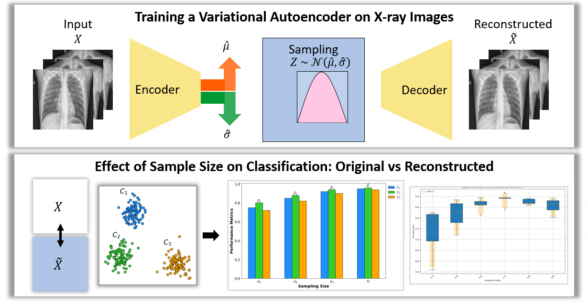

# Variational Autoencoder (VAE) for X-ray Image Reconstruction
This project demonstrates the use of a Variational Autoencoder (VAE) to reconstruct X-ray images. The goal is to compare the classification performance of a Random Forest (RF) model on the original images versus the VAE-reconstructed images. This project also explores the effect of varying the sample size on classification performance.

# Project Overview
Variational Autoencoders (VAEs) are powerful generative models that can encode high-dimensional data into a lower-dimensional latent space. This project uses a VAE to compress and reconstruct X-ray images. We then evaluate how well a Random Forest classifier performs on both the original and VAE-reconstructed images with varying amounts of training data.


*Figure 1: Workflow of Training a Variational Autoencoder (VAE) on X-ray Images and Evaluating the Effect of Sample Size on Classification Performance for Original vs Reconstructed Images.*

# Features
- **Training a VAE on X-ray images.**
- **Reconstruction of images using VAE.**
- **Comparison of classification performance on original vs. reconstructed images.**
- **Exploration of sample size effects on classification accuracy.**

# Installation
To run this project, clone the repository and install the required packages:
```bash
git clone https://github.com/Rolahou2/VAE_Sample_Size.git
cd VAE_Sample_Size
pip install -r requirements.txt
```
Make sure you have the following dependencies:

- *Python 3.7+*
- *TensorFlow / PyTorch (for VAE)*
- *Scikit-learn (for Random Forest classifier)*
- *Matplotlib / Seaborn (for plotting)*
- *Pandas, Numpy*

# Usage
To train the VAE on the X-ray dataset, run the following command:
```bash
python train_vae.py --dataset xray_images --epochs 50
```
After training, you can use the pre-trained VAE model to reconstruct the images and evaluate classification performance with Random Forest:
```bash
python evaluate_rf.py --original --vae_reconstructed --sample_size 0.3
```

# Results
## 1. VAE Image Reconstruction
The VAE effectively reconstructs X-ray images from the latent space. Below is an example comparing the original and reconstructed images.

*Figure 1: Original X-ray image (left) compared to VAE-reconstructed image (right).*

## 2. Classification Performance (Original vs VAE)
We evaluated the classification performance of a Random Forest model on both original and VAE-reconstructed images, using different sample sizes. The results show a minimal drop in accuracy with VAE-reconstructed images, demonstrating the efficiency of the VAE in preserving critical information.

Sample Size: 35%
Original Accuracy: 89%
VAE-Reconstructed Accuracy: 86%
Sample Size: 50%
Original Accuracy: 92%
VAE-Reconstructed Accuracy: 90%

## 3. Effect of Sample Size on Classification
Below is a plot showing the classification error rate as a function of sample size for both the original and VAE-reconstructed images.


The graph shows that with larger sample sizes, the performance on both original and reconstructed images converges, while smaller sample sizes reveal more significant differences.

# Conclusion
This project demonstrates that VAEs can be used to reconstruct X-ray images with minimal loss in classification performance, even with smaller data sets. The results suggest that VAE reconstructions could be a valuable tool for data augmentation or reducing data requirements in image-based machine learning tasks.

# References
Two X-ray Datasets were used. This one `kaggle datasets download -d sachinkumar413/covid-pneumonia-normal-chest-xray-images` is used in the training and Validation of VAE model. And this one is used in the evaluation `kaggle datasets download -d qusaiabdo/xray-normal-covid19-pneumonia`.

Shastri, S., Kansal, I., Kumar, S. et al. CheXImageNet: a novel architecture for accurate classification of Covid-19 with chest x-ray digital images using deep convolutional neural networks. Health Technol. 12, 193–204 (2022). https://doi.org/10.1007/s12553-021-00630-x

Kumar S, Shastri S, Mahajan S, et al. LiteCovidNet: A lightweight deep neural network model for detection of COVID-19 using X-ray images. Int J Imaging Syst Technol. 2022;1‐17. DOI: https://doi.org/10.1002/ima.22770
