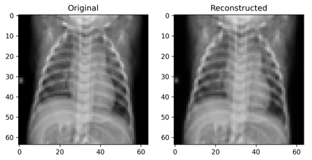
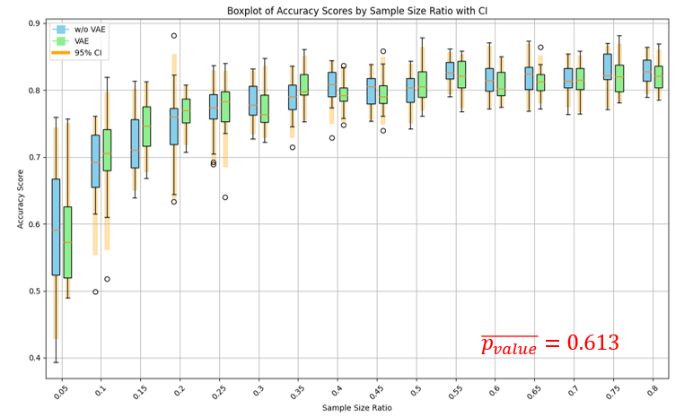
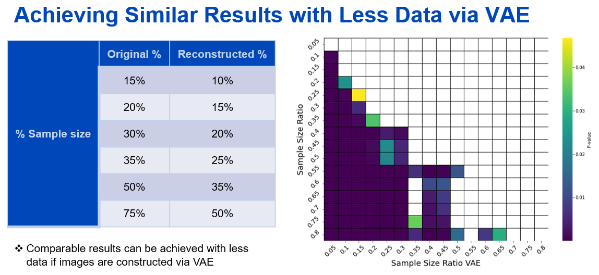

# Variational Autoencoder (VAE) for X-ray Image Reconstruction
This project demonstrates the use of a Variational Autoencoder (VAE) to reconstruct X-ray images. The goal is to compare the classification performance of a Random Forest (RF) model on the original images versus the VAE-reconstructed images. This project also explores the effect of varying the sample size on classification performance.

# Project Overview
Variational Autoencoders (VAEs) are powerful generative models that can encode high-dimensional data into a lower-dimensional latent space. This project uses a VAE to compress and reconstruct X-ray images. We then evaluate how well a Random Forest classifier performs on both the original and VAE-reconstructed images with varying amounts of training data.

<div align="center">
  
  <p><em>Figure 1: Workflow of Training a Variational Autoencoder (VAE) on X-ray Images and Evaluating the Effect of Sample Size on Classification Performance for Original vs Reconstructed Images.</em></p>
</div>

# Features
- **Training a VAE on X-ray images using `kaggle datasets download -d sachinkumar413/covid-pneumonia-normal-chest-xray-images`.**
- **Reconstruction of another testing images acquired from `kaggle datasets download -d qusaiabdo/xray-normal-covid19-pneumonia` using VAE model.**
- **Comparison of classification performance on original vs. reconstructed images.**
- **Exploration of sample size effects on classification accuracy.**

# Installation
To run this project, clone the repository and install the required packages:
```bash
git clone https://github.com/Rolahou2/VAE_Sample_Size.git
cd VAE_Sample_Size
pip install -r requirements.txt
```
Make sure you have the following dependencies:

- **Python 3.7+**
- **TensorFlow / PyTorch (for VAE)**
- **Scikit-learn (for Random Forest classifier)**
- **Matplotlib / Seaborn (for plotting)**
- **Pandas, Numpy**

# Usage
Before you can train the VAE, you need to download the X-ray dataset from Kaggle. Follow these steps:

### Step 1: Download the Dataset from Kaggle
1. Go to [Kaggle's X-ray training dataset page](https://www.kaggle.com/datasets/sachinkumar413/covid-pneumonia-normal-chest-xray-images/data) and [Kaggle's X-ray testing dataset page](https://www.kaggle.com/datasets/qusaiabdo/xray-normal-covid19-pneumonia).
2. Download the datasets to your local machine.

### Step 2: Unzip the Dataset
Unzip the downloaded dataset and place it in an accessible directory on your machine (e.g., `path_to_dataset/`).

### Step 3: Train the VAE Model
Once the dataset is downloaded and unzipped and paths are updated, you can train the VAE model by running the following command:

```bash
python -m src.mainVAE
```

After training, you can use the pre-trained VAE model to reconstruct the testing images (after updating the paths in the code) and evaluate classification performance with Random Forest:
```bash
python vaeSS.py
```

# Results
## 1. VAE Image Reconstruction
The VAE effectively reconstructs X-ray images from the latent space. Below is an example comparing the original and reconstructed images.

<div align="center">
  
  <p><em>Figure 2: Original X-ray image (left) compared to VAE-reconstructed image (right).</em></p>
</div>

## 2. Classification Performance (Original vs VAE)
We evaluated the classification performance of a Random Forest model on both original and VAE-reconstructed images, using different sample sizes. The results show a minimal change in accuracy when using VAE-reconstructed images compared to the original images. This demonstrates the VAE's efficiency in preserving critical information across different sample sizes.

<div align="center">
  
  <p><em>Figure 3: Boxplot showing the classification accuracy scores for Random Forest applied to original (w/o VAE) and VAE-reconstructed images across various sample size ratios. The 95% confidence intervals are shown in yellow, and the p-value indicates no significant difference between the two groups for the given sample sizes (p = 0.613).</em></p>
</div>

### Quantitative Results
- **Sample Size: 35%**
  - Original Accuracy: 78.82%
  - VAE-Reconstructed Accuracy: 80.45%
- **Sample Size: 50%**
  - Original Accuracy: **80.03%**
  - VAE-Reconstructed Accuracy: **80.87%**

## 3. Effect of Sample Size on Classification
The figure below illustrates the learning curves and fitted power law models for Random Forest (RF) classification error rates on original X-ray images and VAE-reconstructed images, across different sample sizes.

<div align="center">
  
  <p><em>Figure 4: The learning curves show the classification error rate as a function of sample size for both original X-ray images (left) and VAE-reconstructed images (right). The RF model trained on VAE-reconstructed images achieves a higher final performance (97.91%) compared to the model trained on original images (93.11%) at larger sample sizes. Both curves show improved performance with increasing data, but the VAE-reconstructed data displays a steeper error rate reduction at smaller sample sizes.</em></p>
</div>

The plots show the classification error rate (y-axis) as a function of sample size (x-axis). Key observations:
Original X-ray Images: The RF model trained on the original images achieves a maximum accuracy of 93.11% at larger sample sizes.
VAE-Reconstructed X-ray Images: The RF model trained on VAE-reconstructed images achieves a higher maximum accuracy of 97.91% at larger sample sizes.
These results demonstrate that the VAE-reconstructed data preserves enough information to achieve slightly higher accuracy than the original data, especially as the sample size increases. Both learning curves indicate that increasing the sample size leads to improved model performance, but for smaller sample sizes, the performance difference between the original and VAE-reconstructed images is more pronounced, with the VAE-reconstructed data yielding a faster improvement in performance.

## Achieving Similar Results with Less Data via VAE

The figure below demonstrates that comparable classification performance can be achieved with less data when using VAE-reconstructed images. The table on the left shows the sample size percentages required for original images versus VAE-reconstructed images to achieve similar classification performance. The heatmap on the right further illustrates the p-values indicating the statistical significance of performance differences between models trained on original images and those trained on VAE-reconstructed images for varying sample sizes.

<div align="center">
  
  <p><em>Figure 5: The table (left) compares the percentage of sample size needed to achieve similar classification performance using original versus VAE-reconstructed images. The VAE-reconstructed images require less data to reach comparable accuracy levels. The heatmap (right) displays the p-values for performance differences between models trained on original images and VAE-reconstructed images across different sample sizes, showing that VAE-reconstructed data can perform similarly to original data with fewer samples.</em></p>
</div>

### Key Insights:
- **Original vs VAE Sample Sizes**: For smaller sample sizes, the VAE-reconstructed data requires less data to achieve similar performance compared to the original data. For example, with only 10% of VAE-reconstructed data, you can achieve similar performance as using 15% of the original data.
- **P-Value Heatmap**: The heatmap on the right shows that for several sample size ratios, the difference in performance between original and VAE-reconstructed data is not statistically significant, as indicated by the dark areas in the heatmap (p-values > 0.05).

*Comparable results can be achieved with less data if images are reconstructed via VAE.*

# Conclusion
This project demonstrates that VAEs can be used to reconstruct X-ray images with minimal loss in classification performance, even with smaller data sets. The results suggest that VAE reconstructions could be a valuable tool for data augmentation or reducing data requirements in image-based machine learning tasks.

# References
Two X-ray Datasets were used. This one `kaggle datasets download -d sachinkumar413/covid-pneumonia-normal-chest-xray-images` is used in the training and Validation of VAE model. And this one is used in the evaluation `kaggle datasets download -d qusaiabdo/xray-normal-covid19-pneumonia`.

Shastri, S., Kansal, I., Kumar, S. et al. CheXImageNet: a novel architecture for accurate classification of Covid-19 with chest x-ray digital images using deep convolutional neural networks. Health Technol. 12, 193–204 (2022). https://doi.org/10.1007/s12553-021-00630-x

Kumar S, Shastri S, Mahajan S, et al. LiteCovidNet: A lightweight deep neural network model for detection of COVID-19 using X-ray images. Int J Imaging Syst Technol. 2022;1‐17. DOI: https://doi.org/10.1002/ima.22770
